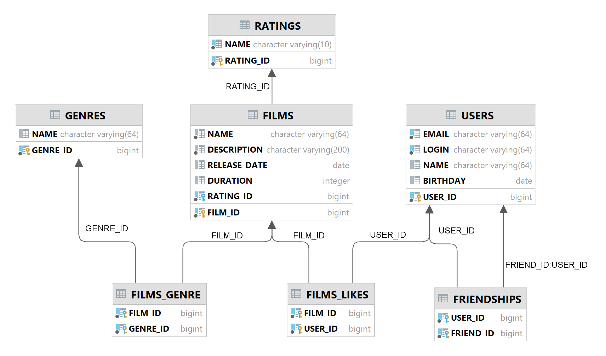

# java-filmorate



## Вкратце об ER-диаграмме
- Таблица `user` содержит подробную информацию о пользователях.
- Таблица `user_friends` содержит информацию о запросах дружбы у пользователей:

  Столбец `status_id` отсылает на значения "Requested" и "Accepted" в таблице `friendship_status`.
- Таблица `film` содержит подробную информацию о фильмах.
- Таблица `film_likes` содержит информацию о фильмах и пользователях, поставивших и лайк.
- Таблица `film_genre` содержит информацию о фильмах и жанрах, к которым они относятся.

## Спринт 10

Сейчас Filmorate хранит все данные в своей памяти. Это приводит к тому, что при перезапуске приложения его история и настройки сбрасываются. Вряд ли это обрадует пользователей!
Итак, нам нужно, чтобы данные:
- были доступны всегда,
- находились в актуальном состоянии.

А ещё важно, чтобы пользователи могли получать их быстро. Для этого вся информация должна храниться в базе данных.
В этом задании вы будете проектировать базу данных для проекта, основываясь на уже существующей функциональности. Вносить какие-либо изменения в код не потребуется.

### Доработка модели
Прежде чем приступить к созданию схемы базы данных, нужно доработать модель приложения. Сейчас сущности, с которыми работает Filmorate, имеют недостаточно полей, чтобы получилось создать полноценную базу. Исправим это!
#### Film
- Добавьте новое свойство — «жанр». У фильма может быть сразу несколько жанров, а у поля — несколько значений. Например, таких:
  - Комедия.
  - Драма.
  - Мультфильм.
  - Триллер.
  - Документальный.
  - Боевик.
- Ещё одно свойство — рейтинг Ассоциации кинокомпаний (англ. Motion Picture Association, сокращённо МРА). Эта оценка определяет возрастное ограничение для фильма. Значения могут быть следующими:
  - G — у фильма нет возрастных ограничений,
  - PG — детям рекомендуется смотреть фильм с родителями,
  - PG-13 — детям до 13 лет просмотр не желателен,
  - R — лицам до 17 лет просматривать фильм можно только в присутствии взрослого,
  - NC-17 — лицам до 18 лет просмотр запрещён.

#### User
- Добавьте статус для связи «дружба» между двумя пользователями:
- неподтверждённая — когда один пользователь отправил запрос на добавление другого пользователя в друзья,
- подтверждённая — когда второй пользователь согласился на добавление.

#### Создание схемы базы данных
Начните с таблиц для хранения пользователей и фильмов. При проектировании помните о том, что:
- Каждый столбец таблицы должен содержать только одно значение. Хранить массивы значений или вложенные записи в столбцах нельзя.
- Все неключевые атрибуты должны однозначно определяться ключом.
- Все неключевые атрибуты должны зависеть только от первичного ключа, а не от других неключевых атрибутов.
- База данных должна поддерживать бизнес-логику, предусмотренную в приложении. Подумайте о том, как будет происходить получение всех фильмов, пользователей. А как — топ N наиболее популярных фильмов. Или список общих друзей с другим пользователем.

Теперь нарисуйте схему базы данных. Для этого можно использовать любой из следующих инструментов:
- dbdiagram.io.
- QuickDBD.
- Miro.
- Lucidchart.
- Diagrams.net.

#### Последние штрихи
Прежде чем отправлять получившуюся схему на проверку:
- Скачайте диаграмму в виде картинки и добавьте в репозиторий. Убедитесь, что на изображении чётко виден текст.
- Добавьте в файл README.md ссылку на файл диаграммы. Если использовать разметку markdown, то схему будет видно непосредственно в README.md.
- Там же напишите небольшое пояснение к схеме: приложите примеры запросов для основных операций вашего приложения.

## Спринт 11

### Техническое задание

Ура, практика! Пришло время усовершенствовать Filmorate с помощью полученных знаний о базах данных. На этот раз вы добавите ещё одну функциональность — сохранение состояния данных после перезапуска. Уже к концу задания у вас будет завершённое приложение для работы с фильмами и оценками пользователей. Внимание, мотор!
### Организация
В этом спринте вы будете работать в новой ветке. Назовите её add-database. Название ветки важно, потому что к ней привязаны тесты.
### Создание базы данных
В уроках спринта вы использовали PostgreSQL — популярную в индустрии базу данных. Однако сейчас вы будете работать с другой базой. Она называется H2. H2 не требует отдельной установки. Её можно встроить в приложение — достаточно добавить зависимость в сборку проекта. Использование встроенной базы данных упростит тестирование вашего приложения в GitHub.

База будет работать в двух режимах:
- В режиме тестирования H2 будет хранить данные в памяти. **Это позволит базе быстро запуститься на время тестов и удалить все тестовые данные после их завершения.
- В рабочем режиме H2 будет хранить данные в файле на жёстком диске. Это не позволит рабочим данным потеряться между запусками.

Почитайте, как использовать H2 со Spring Boot, в этой статье. Далее следуйте нашей инструкции:
- Добавьте в проект зависимости `com.h2database.h2, org.springframework.boot.spring-boot-starter-data-jdbc и org.springframework.boot.spring-boot-starter-test.`
- Сконфигурируйте базу данных для рабочего режима с помощью файла настроек `application.properties`.

```
spring.sql.init.mode=always
#в jdbc-url укажите, что данные нужно сохранять в файл
spring.datasource.url=jdbc:h2:file:./db/filmorate
spring.datasource.driverClassName=org.h2.Driver
spring.datasource.username=sa
spring.datasource.password=password
```

- Сформируйте структуру базы данных — для этого реализуйте схему, которую вы нарисовали в предыдущем спринте. Обратите внимание: база будет работать, пока работает само приложение. Чтобы подключиться к БД напрямую, используйте встроенный в IntelliJ IDEA функционал или клиент DBeaver.
- Не забудьте обновить модели данных в коде — добавьте новые поля.
- Соберите SQL-запросы, формирующие структуру вашей базы, в отдельный файл в `src/main/resources` с названием `schema.sql` — так схема будет создаваться заново при каждом запуске приложения.

### Работа с DAO
Таблицы созданы. Теперь можно заняться кодом, который будет отвечать за получение данных из базы.
- Вам пригодятся созданные ранее интерфейсы UserStorage и FilmStorage. Напишите для них новую имплементацию — например, UserDbStorage и FilmDbStorage. Эти классы будут DAO — объектами доступа к данным.
- Напишите в DAO соответствующие мапперы и методы, позволяющие сохранять пользователей и фильмы в базу данных и получать их из неё.

### Тестирование
Тестировать приложение вручную — трудоёмкий процесс, который сопряжён со многими ограничениями. Использовать Postman-запросы проще, но такой способ не позволяет протестировать имплементацию методов.

Вам предстоит реализовать интеграционное тестирование (англ. integration testing). С помощью него можно проверить работу приложения с зависимостями — например, с базой данных. Резидентная база данных обеспечит автономность ваших интеграционных тестов — перед каждым их запуском Spring будет создавать новую, чистую БД.

Подробнее об этом виде тестирования мы расскажем в следующем модуле, но простейшую его реализацию вы выполните уже сейчас.

Обратите внимание:

- по аннотации @AutoConfigureTestDatabase Spring понимает, что перед запуском теста необходимо сконфигурировать тестовую БД вместо основной;
- аннотация @SpringBootTest, которой помечается класс с тестами, говорит о том, что перед запуском этих тестов необходим запуск всего приложения;
- аргумент аннотации @RequiredArgsConstructor указывает, что конструктор, созданный с помощью библиотеки Lombok, сможет получать зависимости через механизм @Autowired.

Во время инициализации тестовой базы данных Spring прочитает SQL-запросы из стандартного файла schema.sql, который вы собрали в начале задания, и выполнит их для текущей базы данных. Этот скрипт должен создать схему в тестовой БД.

Теперь можно написать интеграционные тесты для DAO-объектов приложения по примеру выше. С помощью них вы проверите, правильно ли работают ваши запросы к базе данных. Убедитесь, что все публичные методы хранилища покрыты тестами.

### Доработка бизнес-логики
Осталось несколько штрихов. Добавьте в код недостающие DAO-объекты, соответствующие вашей схеме, и завершите описание бизнес-логики. После этого протестируйте поведение программы.

Поскольку в программе появились новые сущности, то нужно обеспечить доступ к ним. Добавьте следующие эндпоинты:
- Для получения списка всех жанров и по идентификатору.
```
GET /genres
GET /genres/{id}

// Пример возвращаемого значения
{
  "id": 1,
  "name": "Комедия"
}
```

- Для получения жанра и рейтинга по идентификатору:
```
GET /mpa
GET /mpa/{id}

// Пример возвращаемого значения
{
  "id": 1,
  "name": "G"
}
```


При создании и получении фильмов достаточно передать список идентификаторов жанров и идентификатор рейтинга. Эти же данные должны передаваться при обновлении, создании и получении фильмов — если нужно, обновите эти эндпоинты.

И последнее небольшое изменение: дружба должна стать односторонней. Это значит, что если какой-то пользователь оставил вам заявку в друзья, то он будет в списке ваших друзей, а вы в его — нет.

### Финальный кадр
Убедитесь, что ваше приложение работает правильно. Проверьте его дополнительно с помощью тестов Postman: sprint.json.